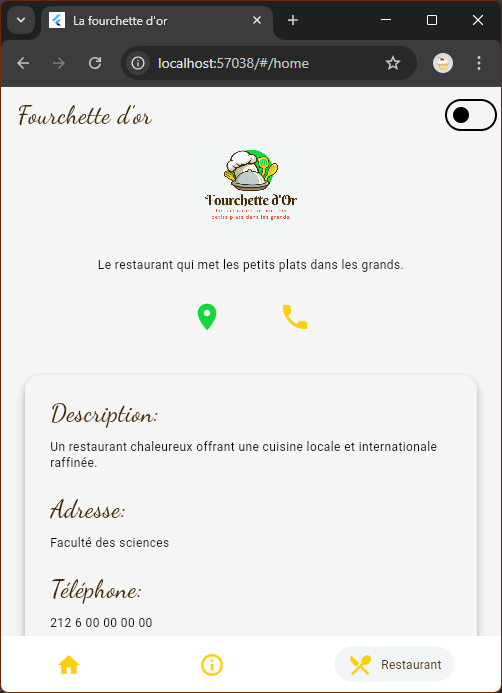

# Fourchette d’Or

<table>
<tr>
<td>Fourchette d’Or est une application mobile développée avec Flutter dans le cadre d’un projet académique. Elle permet de présenter le menu d’un restaurant de manière esthétique, interactive et intuitive.</td>
<td></td>
</tr>
</table>

---

## Aperçu de l'application

Voici quelques captures d’écran illustrant l’interface de l’application :

### Accueil

**En dark mode**

---

### Menu

**En dark mode**

---

###  À propos

**En dark mode**

---

## Objectif

L’objectif du projet est de développer une application mobile Flutter intuitive permettant aux utilisateurs de :
- Consulter les plats par catégorie (entrées, plats, desserts, boissons)
- Donner leur avis (like/dislike)
- Laisser des commentaires
- Visualiser les images des plats
- Naviguer facilement via un **Drawer**

---

## Outils utilisés

- **Flutter** (SDK mobile)
- **Dart** (langage principal)
- **Packages Flutter** :
    - `flutter/material.dart` (UI)
    - `provider` (gestion d’état)
    - `Splash Screen`

---

## Auteurs

- **Maroua OURAHMA**
- **Wiame ANEJJAR**